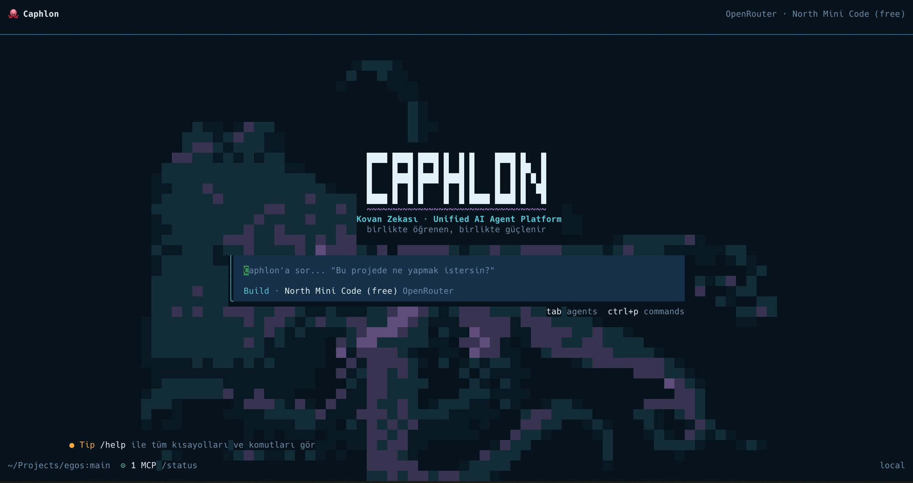

# ⚡ Caphlon

**Unified AI Agent Platform** — Qualixar OS + Open Design + MiMo Code.

A community-powered, decentralized AI development system built around Hive
Intelligence (Kovan Zekası). A collective platform aiming to push open-source
AI models to their peak — without needing massive hardware or budgets.

> *"Together we learn, together we grow stronger."* – Hive Intelligence Manifesto



> For a tour of the interface (welcome screen + model picker), see: [docs/UI.md](docs/UI.md)

---

## Getting Started

```bash
npm install -g caphlon   # the CLI
caphlon setup            # downloads + builds the platform (real tools) — idempotent
caphlon connect          # bind a model provider + API key (once)
caphlon                  # talk
```

`caphlon setup` clones the platform into `~/.caphlon/platform` (override with
`CAPHLON_PLATFORM`) and fetches the real vendored tools from their upstreams
(OpenCode, Aider, Qualixar, MiMo, Open Design; add the experimental layer with
`caphlon setup --all`). Re-running it is safe — it only fills gaps.

<details>
<summary>From source instead (contributors)</summary>

```bash
git clone https://github.com/univerisr-ai/Caphlon.git && cd Caphlon
bash scripts/setup-cores.sh        # fetch tools + build (idempotent)
node packages/caphlon/bin/caphlon.js doctor
cd packages/caphlon && npm link    # optional: `caphlon` from anywhere
```
</details>

> **No subcommands to memorize:** just run `caphlon` and talk. Inside the chat,
> a design request ("build me a Reddit-like landing page") auto-engages Open
> Design, and heavy multi-file code changes auto-engage the real Aider (the
> agent calls the `aider_edit` tool itself). Subcommands below remain for
> direct access.

## Architecture

```
┌──────────────────────────────────────────────────────────────────┐
│  CAPHLON CLI (caphlon/caph)                                     │
│  Single command — access to every component                     │
└──────────────────────────┬───────────────────────────────────────┘
                           │
┌──────────────────────────▼───────────────────────────────────────┐
│  ORCHESTRATOR: Qualixar OS                                      │
│  - Judge pipeline (consensus)                                   │
│  - Forge AI (task dispatch + compose workflow)                  │
│  - Dashboard (24 tabs)                                          │
│  - OPEN DESIGN BRIDGE (design/UI/creative pipeline)             │
│  - MIMO BRIDGE (memory + compose + self-improvement)            │
└──────────────────────┬───────────────────────────────────────────┘
                       │
┌──────────────────────▼───────────────────────────────────────────┐
│  DESIGN LAYER: Open Design                                       │
│  - 100+ skills (prototype, deck, image, video, dashboard)       │
│  - 150 brand-grade DESIGN.md systems (Linear, Stripe, Apple)    │
│  - 261 plugins (scenario, template, migration)                  │
│  - HyperFrames HTML→MP4 motion graphics                        │
└──────────────────────┬───────────────────────────────────────────┘
                       │
┌──────────────────────▼───────────────────────────────────────────┐
│  MEMORY/WORKFLOW LAYER: MiMo Code (fork of OpenCode)            │
│  - Persistent memory (MEMORY.md + SQLite FTS5)                  │
│  - Compose mode (specs-driven development)                      │
│  - Dream/Distill (self-improvement loop)                        │
│  - Goal/Stop condition (judge-gated, prevents premature stop)   │
└──────────────────────┬───────────────────────────────────────────┘
                       │
┌──────────────────────▼───────────────────────────────────────────┐
│  VBS AGENT: Hermes Agent                                         │
│  - Self-improving learning loop                                 │
│  - Batch trajectory generation (training data)                  │
│  - Multi-platform (Telegram/Discord/CLI)                        │
└──────────────────────┬───────────────────────────────────────────┘
                       │
┌──────────────────────▼───────────────────────────────────────────┐
│  FEDERATED: Flower (SuperLink/SuperNode)                        │
│  FINE-TUNING: SmolLM-135M + LoRA (CPU-capable)                   │
│  TOKEN OPT.: tokenless + token-pilot                             │
│  SECURITY: Validator + Reputation + Honeypot                    │
└──────────────────────────────────────────────────────────────────┘
```

## CLI Commands

```bash
caphlon connect      # Bind a model provider + API key (OpenCode-style)
caphlon model        # Show / list / switch the active model
caphlon ui           # Launch the OpenCode interface (the real OpenCode TUI)
caphlon code         # AI pair-programming (via real Aider)
caphlon dev          # Start agent + dashboard
caphlon run "..."    # Run a task
caphlon design       # Design pipeline
caphlon compose      # Compose workflow (8 stages; runs/resume: crash-safe continuation)
caphlon skill        # Skill store: list/add/search/show/learn/evolve/sync
caphlon max          # Blind verification: generate N candidates, a SEPARATE judge model picks the winner
caphlon serve        # LiteLLM proxy — expose the connected model as an OpenAI-compatible endpoint
caphlon tools        # Connect external agent CLIs (e.g. Claude Code) to Caphlon
caphlon hive         # Hive intelligence: multi-sample consensus
caphlon hermes       # Hermes Agent (Experimental — see Components table)
caphlon flower       # Federated learning (Experimental)
caphlon tokenless    # Token compression (Experimental)
caphlon disconnect   # Remove a provider's key
caphlon status       # System status
caphlon doctor       # Diagnostics (--fix: repairs the setup)
caphlon init         # Initialize a project
```

> **Blind verification:** the producer can't grade its own work. Connect a
> separate judge model and use max: `caphlon connect groq --judge` → `caphlon max "task"`.

> **Token-saving cache:** before solving any technical problem, the agent calls
> `cache_borrow` — a hit returns a previously verified solution instead of
> regenerating it (~80-90% tokens saved per hit, measured model). Every borrow
> closes with `cache_report` (worked / failed + correction), so broken
> knowledge can't poison the pool. Personal notes never leave the machine;
> shared entries pass a secret-scan gate. See `caphlon status` → Cache panel.

> Every component binds to a single model: connect once with `caphlon connect`
> and Qualixar OS / Aider / the orchestrator all use the same one. Details:
> [docs/integration/BEST_OF_BREED.md](docs/integration/BEST_OF_BREED.md)

## 🐝 Hive Intelligence — the more people use it, the stronger it gets

Even with weak hardware (2GB RAM / 3rd-gen i5) and a weak model, get closer to
strong-model quality through **crowd + consensus + shared memory**. It takes
participation, not money. Details: [docs/HIVE.md](docs/HIVE.md)

```bash
# Single machine, today — sample the connected model N times, strengthen with consensus
caphlon hive solve "What's the bug in this function?" --samples 5

# Proof: more nodes → more power (simulation)
caphlon hive demo

# Set up a swarm (thousands-of-users scenario)
caphlon hive serve                         # coordinator (or: docker compose up -d hive)
caphlon hive join --id n1                  # each user joins with their own node (n1, n2, ...)
caphlon hive ask "what is 2+2?"            # hive consensus answer

# Accumulated power: submit a local LoRA contribution / pull the current shared adapter
caphlon hive submit-delta --id n1 --delta delta.json
caphlon hive pull --out adapter.json
```

Power layers: **self-ensemble** (single user, instant) · **swarm consensus**
(multi-user, instant) · **shared solution cache** (N users = N× memory) ·
**federated LoRA** (accumulated). Security: validator + reputation + honeypot +
anomaly filtering. Privacy: raw data never leaves the machine — only weight
deltas are shared.

**Living Marketplace — learned lessons get shared:** `caphlon skill evolve`
extracts a candidate skill from a task trace → an **independent** judge
approves it → the approved lesson is written to `learned/`. `caphlon skill
sync push <owner/repo>` pushes these lessons to a git repo; another user pulls
the same lessons with `caphlon skill sync pull` without running anything
unapproved (it's a git shell-out — we have no distribution protocol of our
own). Publishing always requires a separate human approval; even `--yes`
doesn't auto-push.

### ⚖️ Honest evaluation — real measurements

This project's claims were **measured against real models** (not marketing, but measurement):

| Scenario | SOLO | HIVE | Δ | Why |
|---|---|---|---|---|
| Strong model (deepseek-v4-flash, 12 hard tasks) | 100% | 100% | **0** | ceiling — no room to lift |
| Weak model (qwen 0.5b, self-ensemble) | 50% | 50% | **0** | errors are **correlated** (always the same mistake) |

**Bottom line:** pure consensus makes no difference when nodes run the
**same** model — because a single model's (or its copies') errors aren't
independent, they're systematic (the Condorcet jury theorem requires
independence). Real gains require:

- **Model diversity** (different models → independent errors → consensus corrects them), or
- **Shared memory** (cache: whoever solves it once, everyone else gets it free — the most solid win), or
- **Federated** accumulation (with a fail-safe + eval gate).

> So "thousands of **identical** weak nodes → strong model" doesn't work on
> its own; the correct version of the thesis is **diversity + accumulated
> memory**. This is documented by measurement, not assumption.

## Components

| Layer | Tool | Status | License | Docs |
| :--- | :--- | :--- | :--- | :--- |
| CLI | [Caphlon](packages/caphlon/) | **Core** | MIT | [README](packages/caphlon/README.md) |
| Interface (TUI) | [OpenCode](https://github.com/sst/opencode) (integrated) | **Core** | MIT | [docs/integration/BEST_OF_BREED.md](docs/integration/BEST_OF_BREED.md) |
| Pair-Programming | [Aider](https://github.com/Aider-AI/aider) (integrated) | **Core** | Apache 2.0 | [docs/integration/BEST_OF_BREED.md](docs/integration/BEST_OF_BREED.md) |
| Orchestrator | [Qualixar OS](https://github.com/qualixar/qualixar-os) | Conditional | FSL-1.1-ALv2 | — |
| Design/UI Pipeline | [Open Design](https://github.com/nexu-io/open-design) (integrated) | Conditional | Apache 2.0 | [docs/integration/OPEN_DESIGN_INTEGRATION.md](docs/integration/OPEN_DESIGN_INTEGRATION.md) |
| Memory/Workflow | [MiMo Code](https://github.com/XiaomiMiMo/MiMo-Code) (integrated) | Conditional | MIT | [docs/integration/MIMO_CODE_INTEGRATION.md](docs/integration/MIMO_CODE_INTEGRATION.md) |
| Security | Custom (Validator + Reputation + Honeypot) | Conditional | MIT | — |
| VBS Agent | [Hermes Agent](https://github.com/NousResearch/hermes-agent) | Experimental | MIT | — |
| Federated | [Flower](https://github.com/flwrlabs/flower) | Experimental | Apache 2.0 | — |
| Fine-Tuning | SmolLM + LoRA (TRL/PEFT) | Experimental | Apache 2.0 | — |
| Token Opt. | [tokenless](https://github.com/TokenFleet-AI/tokenless) | Experimental | Apache 2.0 | — |

### Core / Conditional / Experimental — an honest label

- **Core** — where the daily value comes from: the OpenCode TUI, Aider, and
  Caphlon's own ideas (`connect`'s single-key distribution, the skill layer +
  blind verification, doctor/status). Without these, Caphlon has no reason to exist.
- **Conditional** — valuable if you actually use that workflow: Open Design if
  you do design work, Qualixar if you run multi-agent tasks, MiMo if you use
  the MEMORY.md/compose patterns. If you don't, it's just disk weight.
- **Experimental** — wired and working, but has not YET proven end-to-end
  value: the Hermes→Flower federated training pipeline has never actually been
  run, tokenless's used surface is narrow, and the Hive's multi-machine
  federation is speculative on a single machine. "Works" and "needed" are
  different things.

> **Rule:** if an Experimental piece goes untouched for a few weeks of real
> use, its copy stays but it drops out of the mental overhead (doctor
> expectations, setup steps, doc priority). The promote/retire decision comes
> from usage, not a desk discussion.

## Requirements

- Node.js **22 LTS** — the Caphlon CLI works with 22+, but Qualixar OS
  specifically needs 22: 24+ breaks the native `better-sqlite3` build
  (setup-cores.sh looks for a compatible Node 22 via brew/nvm on its own)
- Python 3.11+ (fine-tuning)
- Rust 1.89+ (tokenless)
- 2GB+ RAM (runs CPU-only)
