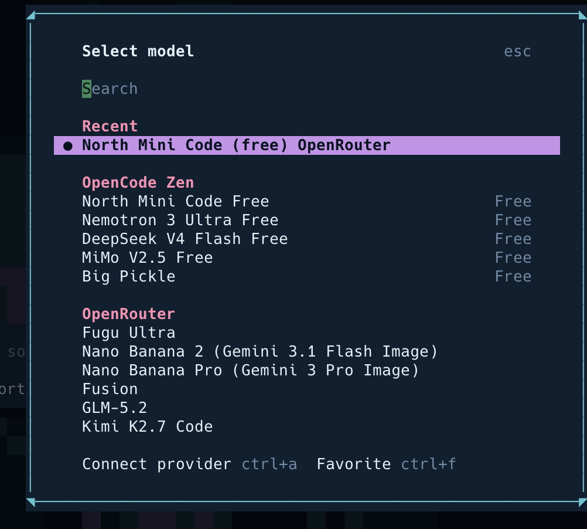

# Caphlon — Arayüz (TUI)

Caphlon'un arayüzü, özelleştirilmiş **OpenCode TUI**'dir: deniz/ahtapot temalı,
tek komutla (`caphlon`) açılan AI sohbet ekranı. Aşağıda ana ekranlar.

## Karşılama ekranı

`caphlon` yazınca açılan ana ekran. Öğeler:

- **Arka plan:** sönük (watermark) deniz ahtapotu — kovan/deniz kimliği.
- **CAPHLON wordmark:** çerçevesiz, parlak; hemen altında dalga ayracı (~) ve
  alt-başlık: *“Kovan Zekası · Unified AI Agent Platform”* + slogan
  *“birlikte öğrenen, birlikte güçlenir.”*
- **Prompt:** yazının tam altında, daraltılmış, ortalanmış giriş kutusu
  (*“Caphlon'a sor…”*). Yazıp Enter'a basınca ekran sohbete döner.
- **Üst çubuk:** 🐙 Caphlon · sağda aktif sağlayıcı/model.
- **Alt çubuk:** `tab agents` · `ctrl+p commands` · ipucu (`/help`) · dizin/MCP/durum.

## Model seçici (`/model`)

`/model` ile açılır; bağlı sağlayıcıların modelleri kategorilere ayrılır:

- **OpenCode Zen** (ücretsiz `public` tier): North Mini Code, Nemotron 3 Ultra,
  DeepSeek V4 Flash, MiMo V2.5, Big Pickle.
- **OpenRouter** ve diğer sağlayıcılar.

Bir model seçmek aktif modeli değiştirir; üst çubukta kaynağıyla birlikte görünür.

## Tema

Renk paleti `packages/caphlon/opencode-profile/themes/caphlon.json`'da: derin
mavi/turkuaz (deniz) + mor/mercan (ahtapot). Arayüz özelleştirmeleri
`opencode-profile/patches/caphlon-ui.patch` ile vendored OpenCode kaynağına
uygulanır.
